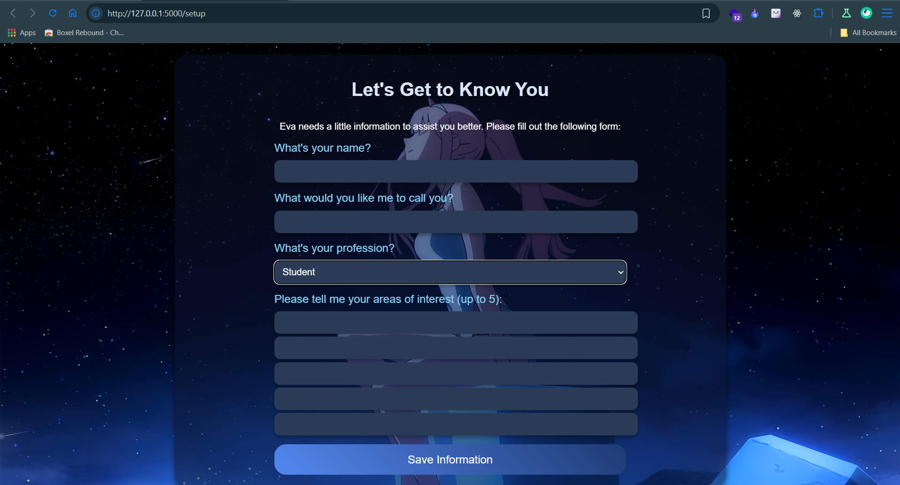
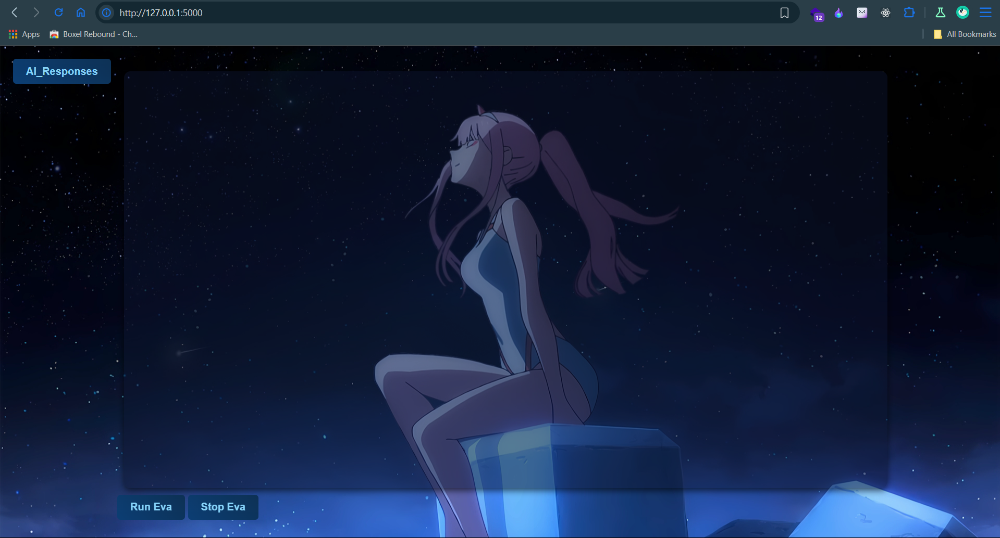
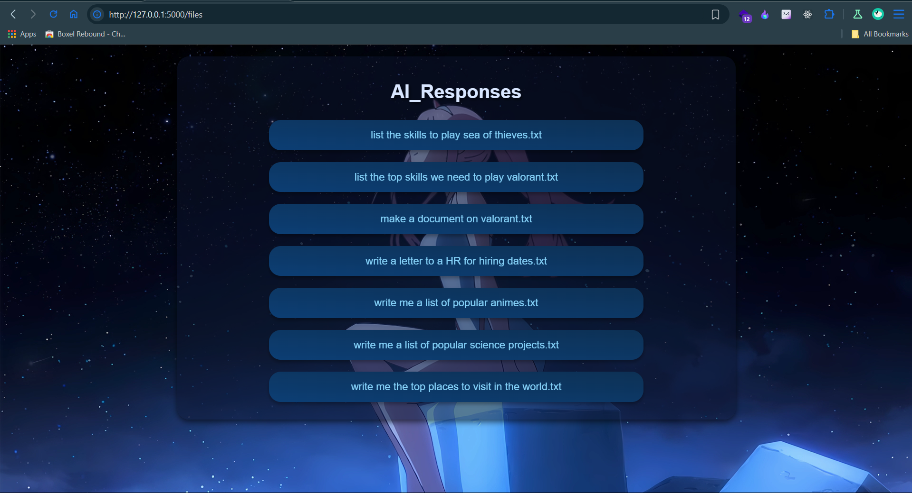
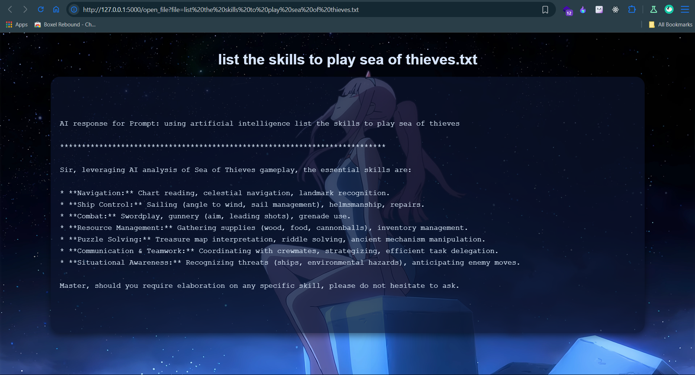

# Eva - Desktop Assistant

**Eva** is an advanced, intelligent desktop assistant built using **Python** to enhance **productivity** and simplify daily tasks. With the power of **speech recognition**, **text-to-speech** functionality, and seamless integration with **Gemini AI**, Eva provides a versatile assistant that can perform a variety of tasks through simple voice commands. Whether it's **opening applications**, **conducting web searches**, or engaging in meaningful **AI conversations**, Eva is designed to adapt to your needs, offering both **convenience** and **efficiency**.

Eva not only helps automate routine tasks but also allows for **customization**, enabling users to personalize their experience by adding new **websites** and **applications** to its repertoire. With a **user-friendly interface** and the ability to **learn and adapt** based on your preferences, Eva is the perfect companion for improving your **productivity** and making **technology** easier to interact with.

## File Structure

```plaintext
Eva
│
├── AI_Response                       # Folder for storing AI-generated responses
│
├── EvaFunctions
│   ├── appHandling.py                # Script for Handling Apps for Eva
│   ├── appLaunch.py                  # Script for Launching Apps Mentioned in Path for Eva
│   ├── geminiConfgs.py               # Script for Configuring and Handling Gemini AI
│   ├── musicHandling.py              # Script for Handling Music and its Features
│   ├── sr_tts.py                     # Script for Speech Recognition and Text-To-Speech
│   └── webSearchHandling.py          # Script for Handling Web Searches
│
├── FlaskApp                          # Flask frontend application
│   ├── static                        # Static assets like images and CSS
│   │   ├── assets
│   │   │   ├── img_background.jpg    # Background image for the UI
│   │   │   └── vid_background.mp4    # Background video for the UI
│   │   └── style.css                 # CSS for styling the application
│   │
│   ├── templates                     # HTML templates for Flask
│   │   ├── ask_info.html             # HTML for user information setup
│   │   ├── display_file.html         # HTML to display AI response files
│   │   ├── files.html                # HTML to list AI response files
│   │   └── index.html                # Main UI for the application
│   │
│   └── app.py                        # Flask application script
│
├── Information                       # Folder to store user data
│   └── user_info.json                # JSON file for saving user information
│
├── path.py                           # Paths for specific assets or applications
├── path.py.example                   # Example template for `path.py`
├── searchDir.py                      # Directories to search for installed applications
├── eva.py                            # Main backend script for the assistant
├── launch_eva.py                     # Script to start Eva easily
├── .env                              # Environment variables (API keys, etc.)
├── .env.example                      # Example template for `.env`
├── .gitignore                        # Files and directories to be ignored by Git
├── requirements.txt                  # Python dependencies for the project
└── README.md                         # Project documentation
```

## Features

- **Speech Recognition**: Eva utilizes Google Speech Recognition to accurately interpret voice commands.
- **Text-to-Speech**: Communicates responses using pyttsx3, ensuring seamless interaction with users.
- **AI Integration**: Integration with the Gemini API enables Eva to generate AI-based responses for complex queries.
- **Web Browsing**: Eva can open predefined websites, providing quick access to frequently visited pages.
- **Application Management**: Allows users to open specific applications installed on their computer effortlessly.
- **Music Playback**: Eva can play music from a specified path, catering to users' entertainment needs.
- **Time Reporting**: Provides real-time reporting of the current time.
- **Web Search**: Performs web searches using Google, facilitating quick access to information.
- **Fuzzy Application Search and Launch**: Search and open any installed applications on your computer, even if the exact name isn't provided.
- **Launch Script**: Easily start Eva with the launch_eva.py script.

## Uses and Scope

Eva serves as a versatile desktop assistant, catering to a wide range of user needs across various domains:

- **Productivity**: Users can utilize Eva to perform tasks such as opening applications, browsing the web, and checking the time, enhancing overall productivity.
- **Entertainment**: Eva enhances the entertainment experience by playing music on command, providing quick access to favorite tunes.
- **Information Retrieval**: With the ability to perform web searches, Eva serves as a valuable tool for retrieving information efficiently.
- **AI Interaction**: The integration with the Gemini API enables users to engage in meaningful conversations with Eva, leveraging advanced AI capabilities.
- **Customization**: Users can customize Eva by adding new websites to the list or modifying the paths for their installed applications.

## Software And Tools Requirements

1. [GitHub Account](https://github.com/)
2. [Gemini Account](https://gemini.google.com/)
3. [Git CLI](https://git-scm.com/book/en/v2/Getting-Started-The-Command-Line)
4. [VSCode IDE](https://code.visualstudio.com/)
5. [Python](https://www.python.org/downloads/)

## Getting Started

### Prerequisites

- Python 3.7 or higher
- `pip` (Python package manager)

### Installation

1. Clone the repository:

   ```sh
   git clone https://github.com/gupta-v/Eva.git
   cd Eva
   ```

````

2. Create and activate a virtual environment (optional but recommended):

   ```sh
   python -m venv env
   env\Scripts\activate
      # On Mac use `source env/bin/activate`
   ```

3. Install the required packages:

   ```sh
   pip install -r requirements.txt
   ```

4. Set up your environment variables:

   - Create a `.env` file in the root directory of the project.
   - Add your Gemini API key to the `.env` file:
     ```
     GEMINI_API_KEY=your_gemini_api_key_here
     ```

5. Set up your application paths:

   - Create a `path.py` file in the root directory of the project.
   - Add your application paths to the `path.py` file:
   - Refer to the `path.py.example` file for the structure.

   ```
    APPLICATION_PATH=your_application_path_here
   ```

6. Set up path of response folder:

   - Add your folder path to the `path.py` file:
   - Refer to the `path.py.example` file for the structure.

   ```
   PATH_TO_AI_RESPONSES="your_path_to_ai_responses"

   ```

## Usage

### Running Eva in CLI (Python Backend)

1. Run the main script:

   ```sh
   python eva.py
   ```

2. Eva will start listening for your commands.Interact As you Like.

3. To quit Eva, say: "Eva quit", "Eva exit".

### Running Eva in the Browser (Flask Frontend)

1. Navigate to the FlaskApp directory:

   ```sh
   cd FlaskApp

   ```

2. Run the Flask application:

   ```sh
   python app.py

   ```

3. Open your web browser and visit http://localhost:5000. You will now be able to control Eva through the browser interface.

   - Start Eva: Click the button to run Eva (runs eva.py in the background).
   - Stop Eva: Stop the process through the UI.
   - View AI Responses: Browse and open the AI-generated responses saved as .txt files in the AI_Responses folder.

4. Open AI_Responses:

   - AI_Responses: Click the button to open the AI-generated responses
   - You can view the AI responses generated by Eva in the AI_Responses.
   - Each response saved there would be listed.
   - You can open the response by clicking on the file name.
   - It will open a new tab with the file.

### Running Eva in the Browser using launch script

1. Run the following command in the terminal (root directory):

   ```sh
      folder/Eva>     python .\launch_eva.py

   ```

2. You will now be redirected to your default browser with opened development server and you will be able to control Eva through the browser interface.

   - Start Eva: Click the button to run Eva (runs eva.py in the background).
   - Stop Eva: Stop the process through the UI.
   - View AI Responses: Browse and open the AI-generated responses saved as .txt files in the AI_Responses folder.

3. Open AI_Responses:

   - AI_Responses: Click the button to open the AI-generated responses
   - You can view the AI responses generated by Eva in the AI_Responses.
   - Each response saved there would be listed.
   - You can open the response by clicking on the file name.
   - It will open a new tab with the file.

## Interaction Commands

- Here are commands that you can say:

  - **Report Time**: "What is the time?"
  - **Play Music**: "Play Music", "Pause music" , "Next Song", "Previous Song"
  - **Open Websites**: "Open YouTube", "Open Google", "Open Wikipedia"
  - **List Websites**: "List Noted Websites"
  - **Web Search**: "Search on web for Python tutorials", "Web Search for Coding contests"
  - **Control Applications**: "Open Opera GX", "Open Spotify"
  - **Scan Disks and Open Installed Applications**: "Search and Launch Canva", "Find application Brave"
  - **AI Interaction**: "Answer me (followed by question or query)"
  - **Enter AI Chat**:
    ```plaintext
    "Eva Listen", "Eva Let's Chat"     # To Enter Chat Mode
    "Eva Quit Chat", "Eva Exit Chat"   # To Quit Chat Mode
    ```
  - **AI Generation**: "Using Artificial Intelligence (followed by request or parameters)"
    - Generates and the response in .txt format and saves it in AI_Response folder
  - **Clearing the Terminal Screen**: "Clear Terminal"
  - **Closing the Program**: "Eva Quit", "Eva Exit"

## Customizations

### Adding Music Directory for Music Controls

1. Add your music directory to the music directory path in the `musicHandling.py` file.
2. Locate this Line of Code in the `musicHandling.py`. It should Look Something Like This.
   ```python
   # Define the music folder path
   MUSIC_FOLDER = "C:/Users/Lenovo/Music" #Add your_music_directory_path
   ```
3. Add Your Own Path for Your Music Folder.

### Adding New Sites

You can customize Eva to open additional websites by modifying the `sites` list in the main script (`eva.py`). Here is an example:

```python
sites = [
            ["Youtube", "https://youtube.com/"],
            ["Instagram","https://instagram.com"],
            ["Google", "https://google.com/"],
            ["Wikipedia", "https://wikipedia.com/"],
            ["GPT","https://chat.openai.com/"],
            ["CLM","https://claude.ai/"],
            ["Internshala","https://internshala.com/"],
            ["GitHub","https://github.com/"],
            ["LinkedIN","https://www.linkedin.com/"]
            ["YourSiteName", "https://your-site-url.com"]
            # Add your site here
        ]
```

### Adding New Applications

You can customize Eva to open additional Applications by adding the code in the main script (`eva.py`). Here is an example:

To add a new application, follow these steps:

- Locate the script in the EvaFunctions named (`appLaunch.py`) where Functions are opened. It should look like this:

  ```python
  def openAppName():
              pathToApp=path.PATH_TO_App
              print("\nOpening your app sir..", flush=True)
              say("Opening your app sir..")
              subprocess.Popen(pathToApp)

  ```

  1.  Add your application paths to the `path.py` file:

      - Refer to the `path.py.example` file for the structure.

      ```python
      PATH_TO_DEVAPP=your_dev_app_application_path_here
      ```

  2.  In `appLaunch.py` Replace `"OpenAppName"` with the name of your application. For example, if your application is named "DevApp", it would look like this:

      ```python
      def openDevApp():
      ```

  3.  Replace the pathToApp variable with the path to your application's executable file. For example:

      ```python
      pathToDevApp = path.PATH_TO_DEVAPP
      ```

  4.  Update the message to be spoken and printed by Eva to indicate the opening of your application. For example:

      ```python
      print("Opening DevApp Sir...",flush=True)
      say("Opening DevApp Sir...")
      ```

  5.  Here's how the updated section would look:

      ```python
      def OpenDevApp():
         pathToDevApp = path.PATH_TO_DEVAPP
         print("Opening DevApp Sir...",flush=True)
         say("Opening DevApp Sir...")
         subprocess.Popen(pathToDevApp)
      ```

- Locate the section in the main script (`eva.py`) where applications are opened. It should look like this:

  ```python
  elif "your_app_name".lower() in query.lower():
              appLaunch.openAppName()
  ```

  1.  Change this After You created the function to open your application `(OpenDevApp)` in `appLaunch.py`.

  2.  In `eva.py` Replace `"your_app_name"` with the name of your application. For example, if your application is named "DevApp", it would look like this:

      ```python
         elif "DevApp".lower() in query.lower():
            appLaunch.openDevApp()
      ```

  3.  Ensure that you have implemented the `openDevApp` function in `appLaunch.py` following the instructions provided for creating the function in `appLaunch.py`.

### Customizing Application Search Directories

Eva allows you to customize the directories it searches for installed applications. To add or modify directories:

1. Open the `searchDir.py` file in the root folder.
2. Locate the `SEARCH_DIRS` list.
3. Add your custom directories as strings, like this:

   ```python
   SEARCH_DIRS = [
       "C:\\Program Files",
       "C:\\Program Files (x86)",
       "C:\\users\\Public\\Desktop",
       "C:\\Windows\\System32",
       "D:\\Custom Apps Dir",  # custom folder paths to search
       "E:\\PortableApps Dir", # custom folder paths to search
       "C:\\Users\\YourName\\Downloads\\Applications", # custom folder paths to search
       os.path.expanduser("~\\AppData\\Roaming\\Microsoft\\Windows\\Start Menu\\Programs"),
   ]
   ```

4. Advantages of This Approach

   - Simplifies customization by keeping all search paths in one file.
   - Prevents users from accidentally modifying eva.py.
   - Ensures that the `SEARCH_DIRS` variable is the single source of truth for directories.

## User Interface

<div style="display: flex; flex-wrap: wrap; justify-content: center; gap: 5px;">

  <div style="text-align: center; width: 45%;">
    
    <p><strong>First-Time Setup Screen</strong></p>
  </div>

  <div style="text-align: center; width: 45%;">
    
    <p><strong>Main Interface</strong></p>
  </div>

  <div style="text-align: center; width: 45%;">
    
    <p><strong>Folder Viewer</strong></p>
  </div>

  <div style="text-align: center; width: 45%;">
    
    <p><strong>File Viewer</strong></p>
  </div>

</div>

## Artificial Intelligence

- Eva utilizes the Gemini API to interact with artificial intelligence. Simply say "Using Artificial Intelligence" followed by your query, and Eva will generate a response using AI.
- Eva keeps a history of your interactions and gathers your information during the initial setup to personalize your experience. Simply say "Answer me" or "Eva Listen," followed by your commands or questions, and Eva will assist you.
- Eva retains your personal information from the initial setup for a personalized experience. However, the chat history is not saved and will reset each time you restart the app.

## Output Folder for AI Responses

Eva saves the AI-generated responses in a folder named AI_Responses in the root directory of the project. If the folder doesn't exist, it will be created automatically. Each response is saved as a text file.

## Important Notes:

- Ensure that the paths to applications and folders in path.py and searchDir.py are valid for your system.

- You can further customize Eva by modifying the eva.py file to include additional websites or applications as per your preferences.
````
